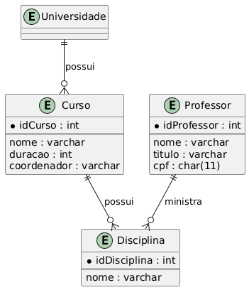
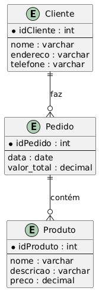
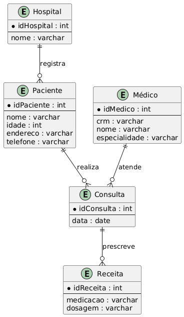

| Exercício 1 — Universidade |
|-----------------------------------------------------------------------|
| Considere uma Universidade que possui vários Cursos. Cada curso tem um nome, uma duração em semestres e um coordenador. A universidade possui Professores, cada um com um nome, título e CPF. Um professor pode ministrar várias disciplinas, e cada disciplina pertence a um único curso. |
| a) Identifique as entidades |
| b) Identifique os atributos de cada Entidade |
| c) Identifique os relacionamentos entre as Entidades |
| e) Faça o diagrama DEM (Diagrama Entidade Relacionamento) contendo as entidades, atributos e relacionamentos que você mapeou. |

------------------------------------------------------------------------

| Exercício 2 — Um Projeto de e-commerce |
|-----------------------------------------------------------------------|
| Um Cliente faz Pedidos em um sistema de e-commerce. Cada cliente tem um nome, endereço e telefone. Os pedidos possuem uma data, um valor total e podem conter vários Produtos. Cada produto tem um nome, uma descrição e um preço. |
| a) Identifique as **entidades** |
| b) Identifique os **atributos** de cada Entidade |
| c) Identifique os **relacionamentos** entre as Entidades |
| e) Faça o **diagrama DEM (Diagrama Entidade Relacionamento)** contendo as entidades, atributos e relacionamentos que você mapeou. |

------------------------------------------------------------------------

| Exercício 3 — Hospital |
|-----------------------------------------------------------------------|
| Um Hospital registra Pacientes, cada um com nome, idade, endereço e telefone. Os pacientes podem realizar várias Consultas com Médicos. Cada médico possui um CRM, um nome e uma especialidade. Durante a consulta, o médico pode prescrever Receitas, que possuem medicação e dosagem. |
| a) Identifique as **entidades** |
| b) Identifique os **atributos** de cada Entidade |
| c) Identifique os **relacionamentos** entre as Entidades |
| e) Faça o **diagrama DEM (Diagrama Entidade Relacionamento) contendo as entidades, atributos e relacionamentos** que você mapeou. |

------------------------------------------------------------------------

## Respostas dos exercícios

### Exercício 1

### Exercício 2

### Exercício 3

